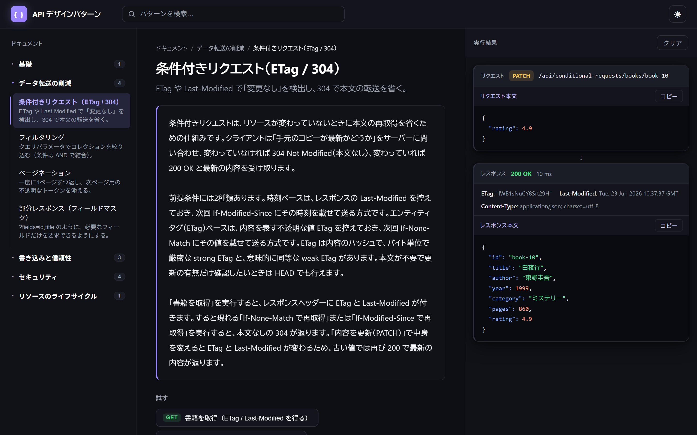

# API デザインパターン — インタラクティブ・プレイグラウンド

よく使われる **Web API のデザインパターン** を、それぞれ実際に動作する HTTP エンドポイント
として体験できる、小さく実行可能なリファレンスです。左の一覧からパターンを選び、リクエストを
クリックすると、右側のコンソールに「リクエスト・レスポンス（ステータス・ヘッダー・ボディ）・
妥当な次の操作（`Location` をたどる、ページトークンを追う）」が表示されます。

**▶ ライブデモ（StackBlitz・インストール不要、ブラウザ上で実行）:**

[](https://stackblitz.com/github/dotNetGaijin87/api-design-patterns-catalog)

 

## ライブデモ / スクリーンショット

下の画像をクリックすると、**StackBlitz でそのままライブ実行**できます（ブラウザ内で Node サーバーが起動します）。「条件付きリクエスト（ETag / 304）」で **内容を更新（PATCH）** を実行した直後の様子で、レスポンスに更新後の `ETag` と `Last-Modified` が付きます。

[](https://stackblitz.com/github/dotNetGaijin87/api-design-patterns-catalog)

## クイックスタート

```bash
npm start # http://localhost:3000 を開く
```

## 含まれるパターン

| カテゴリ                 | パターン                                 | 何を示すか                                                                                            | エンドポイント名前空間         |
| ------------------------ | ---------------------------------------- | ----------------------------------------------------------------------------------------------------- | ------------------------------ |
| 基礎                     | **標準メソッド（CRUD）**                 | List / Get / Create / Update / Delete の正攻法。`201 + Location`、部分更新の `PATCH`、`204`           | `/api/standard-methods`        |
| データ転送の削減         | **ページネーション**                     | 不透明な `nextPageToken` カーソルによる固定サイズのページ                                             | `/api/pagination`              |
| データ転送の削減         | **フィルタリング**                       | AND で結合するクエリパラメータでコレクションを絞り込む                                                | `/api/filtering`               |
| データ転送の削減         | **部分レスポンス**                       | フィールドマスク（`?fields=id,title`）で over-fetching を避ける                                       | `/api/partial-response`        |
| データ転送の削減         | **条件付きリクエスト**                   | `ETag`／`Last-Modified` と `If-None-Match`／`If-Modified-Since` で `304 Not Modified`                 | `/api/conditional-requests`    |
| 書き込みと信頼性         | **冪等性キー**                           | 安全な POST リトライ。同じ `Idempotency-Key` は元の結果を返す                                         | `/api/idempotency`             |
| 書き込みと信頼性         | **長時間実行オペレーション**             | `202 Accepted` ＋ 進捗をポーリングできる Operation                                                    | `/api/long-running-operations` |
| 書き込みと信頼性         | **楽観的並行性制御**                     | `If-Match` ＋ `ETag` でロストアップデートを防ぐ（`412`／`428`）                                       | `/api/optimistic-concurrency`  |
| セキュリティ             | **認証（Bearer トークン）**              | `Authorization: Bearer` を検証。無ければ `401` + `WWW-Authenticate`                                   | `/api/auth-bearer`             |
| セキュリティ             | **認可（スコープ）**                     | スコープ不足は `403`。最小権限の原則                                                                  | `/api/authorization-scopes`    |
| セキュリティ             | **レート制限**                           | `429 Too Many Requests` + `Retry-After` + `RateLimit-*`                                               | `/api/rate-limiting`           |
| セキュリティ             | **セキュリティヘッダー（ハードニング）** | `Strict-Transport-Security`・`X-Content-Type-Options`・`Content-Security-Policy` などの防御的ヘッダー | `/api/security-headers`        |
| リソースのライフサイクル | **ソフトデリート**                       | 物理削除ではなくトゥームストーン化。`showDeleted` と `:undelete`                                      | `/api/soft-deletion`           |

## 構成

```
server.js              HTTP サーバー: 各パターンを /api/<id> にマウントし UI を配信
src/
  core/                フレームワークと配線
    mini-app.js        Node http の上の極小 Express 風シム（app.scope で名前空間ルーター）
    registry.js        patterns/ を自動検出（カテゴリ順 → ファイル名順）
    catalog.js         /api/_meta のペイロードを組み立てる
    http.js            共通ヘルパー: notFound() / error() / etag()
  domain/              共有ドメイン
    books.js           シードデータ（書籍カタログ）
    store.js           再利用可能なインメモリ・リポジトリ
  patterns/            パターンごとに 1 ファイル（相対パスのルートのみ）
    standard-methods.js …
  categories.js        カテゴリ定義（UI の並び順）
public/
  index.html           プレイグラウンドの土台（3 カラムレイアウト）
  app.js               データ駆動の UI: /api/_meta を読み、リクエストをライブ実行
  style.css            スタイル（ライト/ダーク切替）
```

画面は 3 カラム構成です。**左**: パターン一覧、**中央**: 解説とデモ用リクエスト、
**右**: リクエスト／レスポンスのコンソール（常に表示）。

UI は単一のエンドポイント `GET /api/_meta` だけで駆動されます。これは各パターンの
メタデータとデモリクエストを返します。フロントエンドはパターンをハードコードせず、
API が公開する内容をそのまま描画します。

### 新しいパターンの追加

`src/patterns/<name>.js` を作成して `{ meta, demos, register }` を export する**だけ**です。
`registry.js` が自動検出し、サーバーが `/api/<id>` にマウントし、UI も取り込みます。
登録リストへの追記は不要です。`register` は名前空間付きルーター（相対パス）を受け取り、
`demos[].path` も相対パスで書きます。

```js
module.exports = {
  meta: { id, category, title, blurb, docs },        // category は categories.js の id
  demos: [{ label, method, path, headers?, body? }], // path は '/books' のように相対
  register(r) {                                      // r は /api/<id> にスコープ済み
    r.get('/books', (req, res) => res.json({ books: store.list() }));
    // 絶対パスが必要なら r.base（= '/api/<id>'）を使う
  }
};
```

## メモ

- データはすべてメモリ上にあり、再起動でリセットされます。状態を変更するパターンには
  **リセット**用リクエストも用意してあり、いつでもクリーンな状態に戻せます。
- ローカルの PDF はリポジトリを軽く保つため git 管理から除外しています。PDF をコミット
  したい場合は `.gitignore` の `*.pdf` の行を削除してください。
